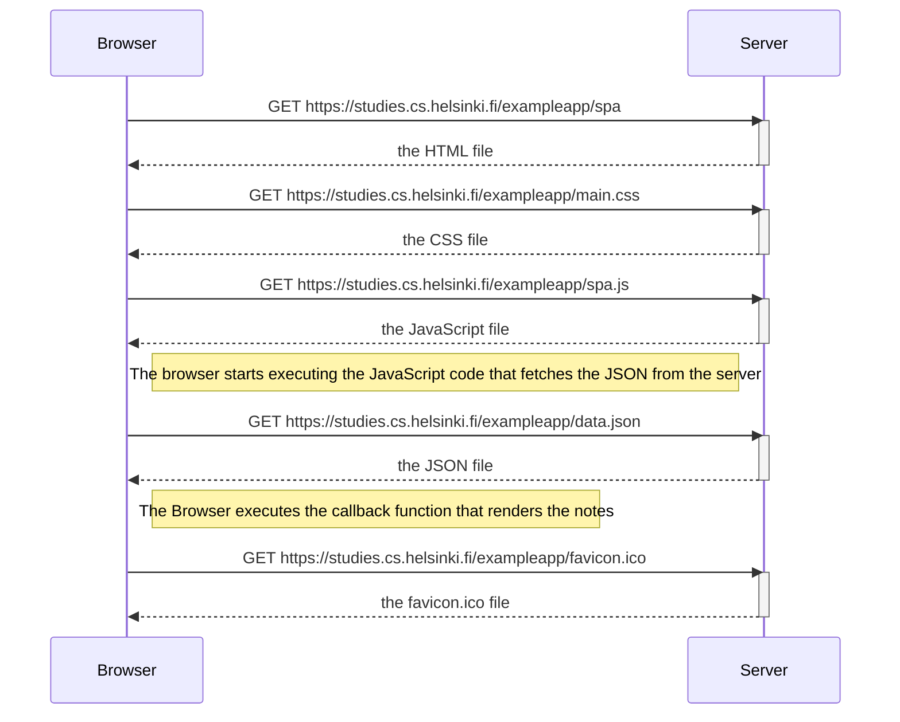

```mermaid
sequenceDiagram
participant Browser
participant Server

    Browser->>Server: GET https://studies.cs.helsinki.fi/exampleapp/spa
    activate Server
    Server-->>Browser: the HTML file
    deactivate Server

    Browser->>Server: GET https://studies.cs.helsinki.fi/exampleapp/main.css
    activate Server
    Server-->>Browser: the CSS file
    deactivate Server

    Browser->>Server: GET https://studies.cs.helsinki.fi/exampleapp/spa.js
    activate Server
    Server-->>Browser: the JavaScript file
    deactivate Server

    Note right of Browser: The browser starts executing the JavaScript code that fetches the JSON from the server

    Browser->>Server: GET https://studies.cs.helsinki.fi/exampleapp/data.json
    activate Server
    Server-->>Browser: the JSON file
    deactivate Server

    Note right of Browser: The Browser executes the callback function that renders the notes

    Browser->>Server: GET https://studies.cs.helsinki.fi/exampleapp/favicon.ico
    activate Server
    Server-->>Browser: the favicon.ico file
    deactivate Server

```