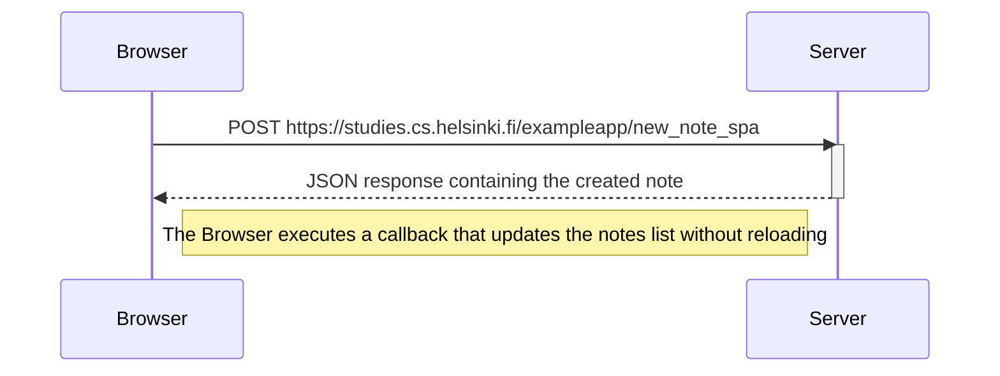

```mermaid
sequenceDiagram
participant Browser
participant Server

    Browser->>Server: POST https://studies.cs.helsinki.fi/exampleapp/new_note_spa
    activate Server
    Server-->>Browser: JSON response containing the created note
    deactivate Server

    Note right of Browser: The Browser executes a callback that updates the notes list without reloading
```